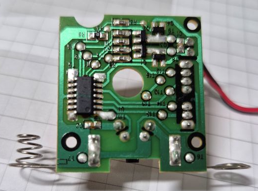

# Custom Glade Automatic Air Freshener ([ver en Español](README_ES.md))

The Glade Automatic Air Freshener is an electronic product that automatically activates an air spray every 9, 18, or 36 minutes. These time intervals are fixed and cannot be changed. This hack allows you to create your own logic and set any activation time you want. The same base can also be used for remote control by adding a Bluetooth device or similar. You can also add a light sensor so that it only works during the day.


## Reverse Engineering

The product basically uses a [EM78P153A](res/EM78P153A-ELANMicroelectronics.pdf) microcontroller from the Korean manufacturer ELAN, with OTP ROM, which means it can only be programmed once. It reads the time switch configuration and activates a DC motor that triggers the air spray.




### Operation

The internal logic of the microcontroller cannot be read, but by analyzing the inputs and outputs, we can deduce its operation and schematic diagram.

1. It reads the input from the time selection switch: off, 9, 18, or 36 minutes, on pins 1,2,3,5,6. These pins have pull-ups, so a LOW signal activates the pin. Only one can be active at a time, except for pin 1 which is the manual spray switch and can be activated in any state except off.
2. The microcontroller waits internally for the configured time or until the manual switch is pressed, and then sends two pulses to the DC motor from pins 13,12–10,9,8, one forward and one reverse, by switching polarity using the H-bridge. This pulls the wedge and presses the spray nozzle.

Pulse sent to the DC motor:


Schematic diagram:


## Hack

For this hack, we remove the [EM78P153A](res/EM78P153A-ELANMicroelectronics.pdf) microcontroller and replace it with an [ATtiny85](res/atmel-2586-avr-8-attiny85_datasheet.pdf). This microcontroller has fewer pins, so we sacrifice the time selection options and only allow two states: off and automatic. The automatic interval is defined internally (in this case, every 1 hour), and manual activation of the spray is allowed both in off and automatic modes.

The diagram is as follows:


> It's important to note that the parameters `TUNE_DELAY_LOOP_2_COUNT_TO_1MS` and `TUNE_WDT_REAL_TICK_TIME_IN_SEC` must be manually tuned through trial and error or with an oscilloscope, since the internal oscillator of the [ATtiny85](res/atmel-2586-avr-8-attiny85_datasheet.pdf) is not very precise and has a factory tolerance error — unless you use an external oscillator.

### Programming

The source code was created for the [ATtiny85](res/atmel-2586-avr-8-attiny85_datasheet.pdf) and compiled using `avr-gcc`. It was designed for low power consumption, so the internal clock was set to 128kHz. To use pin 1 (RESET) as a GPIO, the RSTDISBL fuse was enabled — be careful when enabling this, as you won't be able to reprogram the microcontroller unless you disable the fuse using a high voltage programmer (HVSP). You can also do it with an Arduino: https://www.rickety.us/2010/03/arduino-avr-high-voltage-serial-programmer/.

The steps to compile and flash are roughly:

```sh
# compile
avr-gcc -mmcu=attiny85 -DF_CPU=128000UL -Os -o main.elf main.c
avr-objcopy -O ihex -R .eeprom main.elf main.hex
# flash
avrdude -c buspirate -P COM7 -p t85 -U flash:w:main.hex:i
# burn fuses for 128kHz and RSTDISBL
avrdude -c usbasp -p t85 -U lfuse:w:0x62:m -U hfuse:w:0x5f:m -U efuse:w:0xff:m
```

The source code is in the file [main.c](main.c), and if you prefer a ready-to-flash compiled version, it’s in [main.hex](main.hex)
