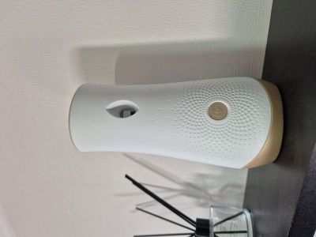
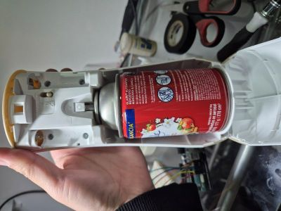
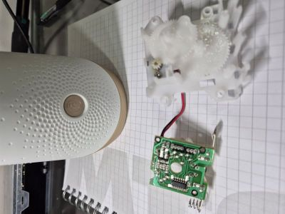
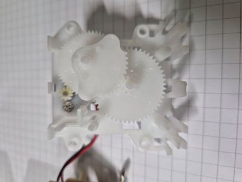
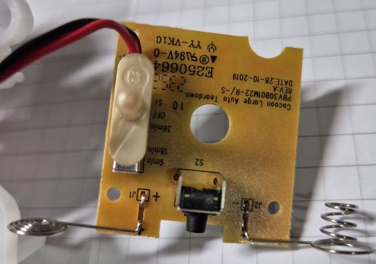
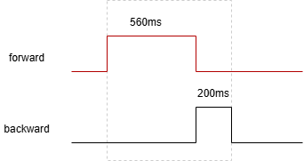
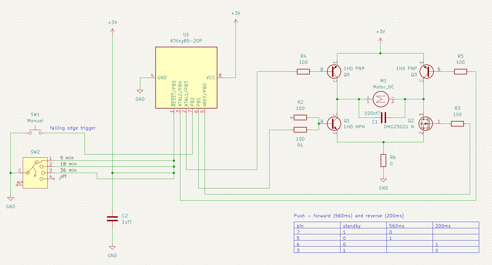
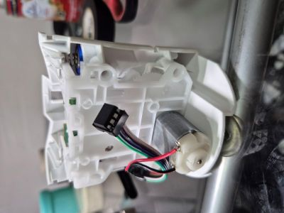

# Custom Glade Automatic Air Freshener ([view in Spanish](README.md))

Glade Automatic Air Freshener, es un producto electronico que activa un spray ambiental automaticamente entre 9, 18 o 36 minutos, estos tiempos son fijos y no se pueden cambiar. Este hack permite crear tu propia logica de funcionamiento y establecer el tiempo de activación que tu quieras. la misma base tambien puede ser usada para control remoto agregando algun dispositivo bluetooth o similar.




## Ingeniera inversa

El producto basicamente usa un microcontrolador [EM78P153A](res/EM78P153A-ELANMicroelectronics.pdf) del fabricante coreano ELAN, con OTP ROM, por lo que solo se puede describir una unica vez, que revisa la configuración del switch de tiempos y activa un motor DC que acciona el spray ambiental.







### Funcionamiento

La logica interna del microcontrolador es imposible de leer, pero analizando la entrada y salida podemos deducir su funcionamiento y su diagrama esquemático.

1. lee la entrada desde switch off, 9, 18 o 36 minutos, en los pines 1,2,3,5,6, estos pines son pull up, por lo que una señan LOW activa el pin, solo se activa una a la vez, excepto por el pin 1 que es la switch manual del spray y puede ser activado en cualquier estado excepto en off.
2. el microcontrolador espera internamente durante el tiempo configurado o bien cuando se accione el switch manual y envia dos pulsos al motor DC desde los pines 13,12-10,9,8, uno de avance y otro de retroceso, invirtiendo la polaridad gracias al puente H, extrayendo la cuña y presionando sobre el spray accionandolo.

pulso generado hacia el motor DC:



diagrama esquematico


## Hack

Para esto eliminamos el microcontrolador [EM78P153A](res/EM78P153A-ELANMicroelectronics.pdf) y lo reemplazamos por el [ATtiny85](res/ATtiny85.pdf). Este procesador tiene menos pines por lo tanto sacrificamos las opciones de seleccion de tiempo y solo permitimos dos estados, off y automatico, definiendo el tiempo automatico internamente en el microcontrolador (en este caso cada 1 hora) y permitiendo la activacion manual del spray tanto en off como en automático.

El diagrama es el sig:






> es importante destacar que los parametros `TUNE_DELAY_LOOP_2_COUNT_TO_1MS` y `TUNE_WDT_REAL_TICK_TIME_IN_SEC`, deben ser afinados de forma manual tras prueba y error o con un osciloscopio, ya que el oscilador interno del [ATtiny85](res/ATtiny85.pdf) no es muy preciso y tiene un % de fallo de fabrica - a menos que uses un oscilador interno.

### Programación

El código fuente fue creado para el [ATtiny85](res/ATtiny85.pdf) y compilado con `avr-gcc`, diseñado para bajo consumo de energía por lo que se estableció el clock interno a 128kHz y para aprovechar el pin 1 (RESET) como gpio se activó el fuse RSTDISBL - asi que ten cuidado cuando lo actives ya que no podras volver a programar el microcontrolador a menos que desactives ese fuse con un programador de alto voltaje HVSP. tambien puede hacerlo con un arduino https://www.rickety.us/2010/03/arduino-avr-high-voltage-serial-programmer/.

los pasos para compilar y grabar serian algo asi:

```sh
# compilamos
avr-gcc -mmcu=attiny85 -DF_CPU=128000UL -Os -o main.elf main.c
avr-objcopy -O ihex -R .eeprom main.elf main.hex
# grabamos
avrdude -c buspirate -P COM7 -p t85 -U flash:w:main.hex:i
# quemamos los fuses para 128kHz y RSTDISBL
avrdude -c usbasp -p t85 -U lfuse:w:0x62:m -U hfuse:w:0x5f:m -U efuse:w:0xff:m
```

el código fuente encuentra en el archivo [main.c](main.c) y si prefires el compilado listo para grabar está en [main.hex](main.hex)

